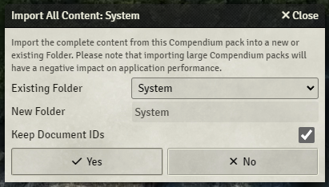
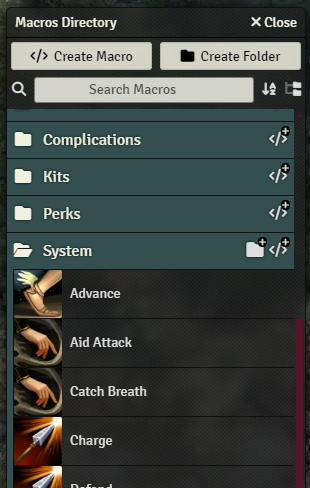
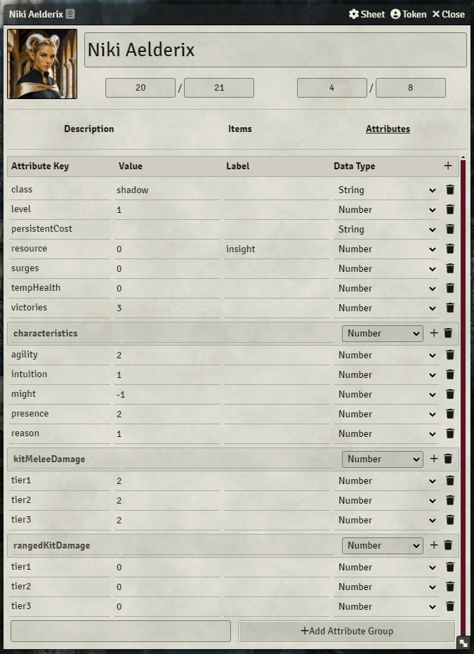
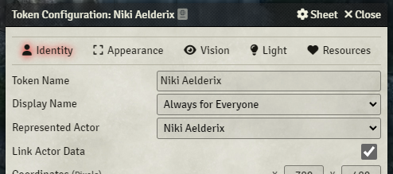

# Draw Steel Playtest Macros

A Foundry VTT module containing several compendiums of macros that can be used for running a playtest game of Draw Steel. These macros allow abilities and features to be sent to the chat with a button that automatically rolls a power roll, calculates the resulting damage, deducts the resource cost, and more.

General macros for managing health, recoveries, resource, surges, persistent effects, etc. during combat have also been implemented (most of which are found in the **Combat** compendium).

Note that these macros only include a subset of the complete Draw Steel playtest ruleset.

## Setup and Usage

After installing and enabling this module, a set of macro compendiums should appear. To use these macros, they should first be imported by right-clicking on each compendium and selecting "Import All Content".

In the window that appears, ensure you select "Keep Document IDs" so that future imports update the macros rather than creating new ones. Also ensure you select the existing folder if this is not your first time importing the macros.

Once they are imported, you should see them in the Macro Directory (which can be opened by clicking the folder icon to the left of the hotbar). These macros can be dragged from the directory to the hotbar, or into the description of the character sheet.

To use the macros, each actor will need to be configured with the following attributes which are expected by the macros, and the health and power should be updated to include the stamina and recoveries, respectively. If you try to use the macros without doing this, you will get errors indicating which which attributes are missing or misconfigured.

    class [String]
    level [Number]
    persistentCost [String]
    resource [Number] - The label must be set to the name of the resource as well
    surges [Number]
    tempHealth [Number]
    victories [Number]
    characteristics [Number group]
    - agility [Number]
    - intuition [Number]
    - might [Number]
    - presence [Number]
    - reason [Number]
    kitMeleeDamage [Number group] - Optional
    - tier1 [Number]
    - tier2 [Number]
    - tier3 [Number]
    rangedKitDamage [Number group] - Optional
    - tier1 [Number]
    - tier2 [Number]
    - tier3 [Number]

Once you've finished setting up the actor, it should look something like the following:

It's also recommended to enable "Link Actor Data" in the token settings for each actor, as the macros will not behave as expected if the token and actor are not linked.

